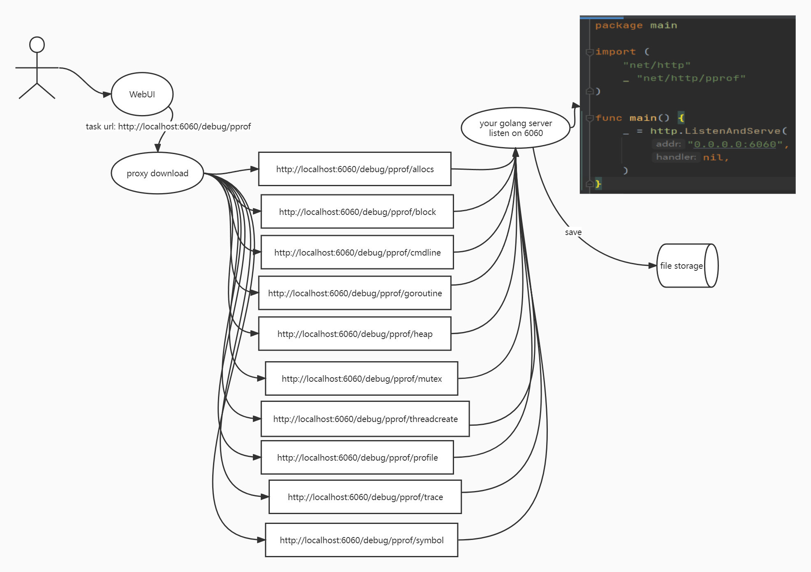
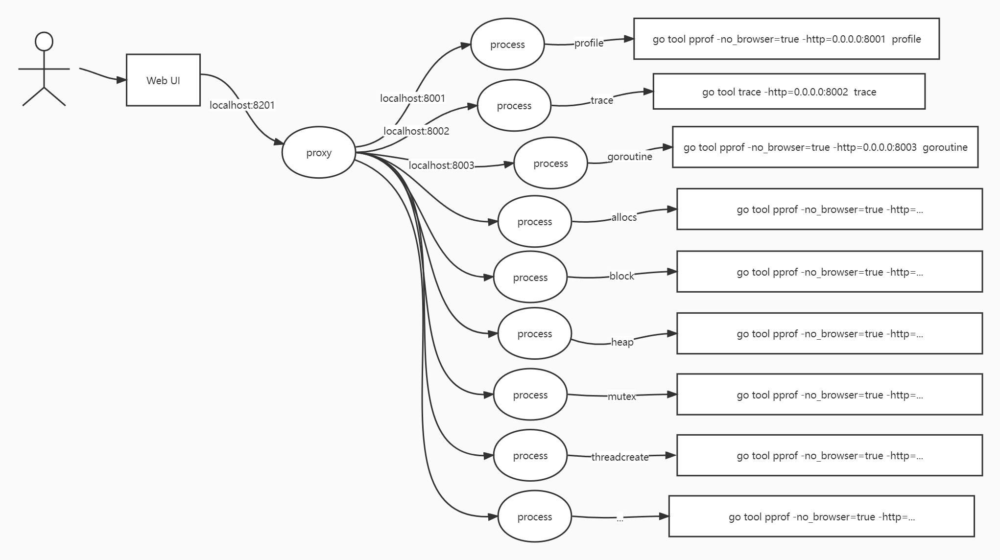

# Prof

The web ui for golang pprof

### Requirements

- golang(pprof trace)
- graphviz

### Quick Use 
```
go install github.com/matteo-gz/prof/cmd/prof@latest
prof
```
### Start it

```
cp env.yaml.example env.yaml
go build -o prof cmd/prof/main.go cmd/prof/wire_gen.go
# start server
./prof -c env.yaml
# start server another way
./prof -port=8201 -port2=8202 env=prod -dir=./storage -log=./logs
```

## Via

- docker-compose `https://github.com/matteo-gz/prof_compose`

## How to Run



```
# demo
# your golang service 
package main

import (
	"net/http"
	_ "net/http/pprof"
)

func main() {
	_ = http.ListenAndServe(
		"0.0.0.0:6060",
		nil,
	)
}

```


